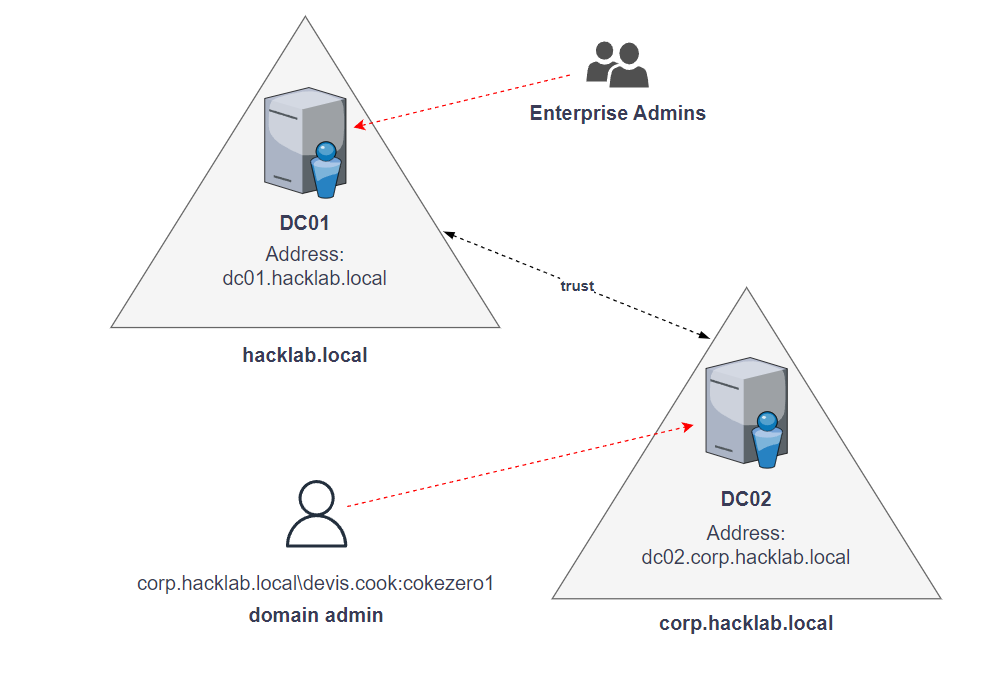

# Scenario 1 - Forest Privilege Escalation



## Description
This laboratory teaches Forest Privilege Escalation from a Child domain to the Root domain.
The user starts with a known privileged Domain Admins' account in the Child Domain; the goal is to escalate privileges and achieve Enterprise Admins inside the Forest.

## Build the hosts
For this scenario two hosts are needed.
They are going to become the DCs so they need Windows Server as OS and to be part of the same network.

NOTE: The lab is tested on Windows Server 2016 and Windows Server 2019.

## How to import the Scenario
Step-by-step operations to import the Scenario are the following.

### 1 - Configure main.yml
The line that imports the scenario in [ansible-playbook/main.yml](../../ansible-playbook/main.yml) needs to be uncommented.<br />
Line: 
```
- import_playbook: playbook/modules/scenario1.yml
```
The line that imports the custom scenario can be uncommented to make the configuration's process faster.
Line:
```
#- import_playbook: playbook/modules/custom.yml
```

### 2 - Configure inventory
Copy [scenarios/scenario1/inventory-scenario1](inventory-scenario1) in [ansible-playbook/](../../ansible-playbook/).

The parameters:
* ansible_host: host's address; public address if in a Cloud environment
* ansible_user: administrator's username
* ansible_password: administrator's password<br />

need to be configured accordingly.

NOTE: dc01 is the Root Domain Controller, dc02 is the Child Domain Controller; to swap the hosts, change "DCs_root" and "DCs_child" groups.


### 3 - Configure vars.yml
Copy [scenarios/scenario1/vars.yml](vars.yml) in [ansible-playbook/playbook/vars/](../../ansible-playbook/playbook/vars/).

Parameters need to be configured accordingly.

Root Domain (default dc01):
* hostname: Domain Controller's hostname.
* private_address: host's private address; it's used to differentiate public and private address if they are different.
* domain: domain's name.
* database_path: NTDS's path.
* log_path: logs' path.
* sysvol_path: SYSVOL's path.
* safe_mode_password: Safe mode administrator's password.

Child Domain (default dc02):
* hostname: Domain Controller's hostname.
* private_address: host's private address; it's used to differentiate public and private address if they are different.
* parent_private_address: parent host's address; private parent's address if in a Cloud environment.
* root_dc_host: host's name of the domain controller of the Root domain.
* domain: domain's name.
* database_path: NTDS's path.
* log_path: logs' path.
* sysvol_path: SYSVOL's path.
* safe_mode_password: Safe mode administrator's password.
* firstname: known user's firstname. The format of the account's name is going to be "firstname.lastname" .
* lastname: known user's lastname. The format of the account's name is going to be "firstname.lastname" .
* password: known user's password.

NOTE: RDP is not configured by default. 
The parameter "rdp: yes" or "rdp: true" must be added to each host on which RDP is to be installed.

## Build the scenario
```
cd ansible-playbook/
ansible-playbook -i inventory-scenario1 main.yml
```

## Notes
I developed the "Forest Privilege Escalation"'s scenario as a thesis for my Master degree in Computer Engineering at Alma Mater Studiorum, Bologna, Italy.


## License
This project is licensed under MIT License - see the LICENSE.md file for details.

