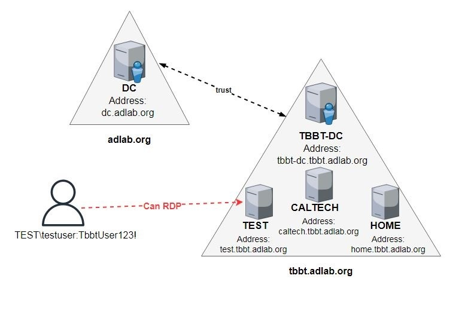

# Scenario 2 - CRTP-TBBT#1



## Description
I made this scenario to simulate a CRTP-like AD environment, using The Big Bang Theory series as universe.
At the time this playbook was created I hadn't enrolled in the CRTP's course yet.
Vulnerable path is based on:
* the course's syllabus
* cheatsheets found online
* "things" that I wanted to learn how to set up and how to exploit.

## Goal
The starting point is the "TEST\testuser" user who can RDP into "TEST" server. His password is "TbbtUser123!.
From here, the goal is to achieve Enterprise Admins in the forest.
Inside [solution/SOLUTION.md](solution/SOLUTION.md) more information about the vulnerabilites and an "High Level Solution" can be found.

## Build the hosts
For this scenario five hosts are needed.
They are going to become the DCs/Servers so they need Windows Server as OS and to be part of the same network.

NOTE: The lab is tested on Windows Server 2019.

## How to import the Scenario
Step-by-step operations to import the Scenario are the following.

### 1 - Configure main.yml
The line that imports the scenario in [ansible-playbook/main.yml](../../ansible-playbook/main.yml) needs to be uncommented.<br />
Line: 
```
- import_playbook: playbook/modules/scenario2.yml
```
The line that imports the custom scenario can be commented to make the configuration's process faster.
Line:
```
#- import_playbook: playbook/modules/custom.yml
```

### 2 - Configure inventory
Copy [scenarios/scenario2/inventory-scenario2](inventory-scenario2) in [ansible-playbook/](../../ansible-playbook/).

The parameters:
* ansible_host: host's address; public address if in a Cloud environment
* ansible_user: administrator's username
* ansible_password: administrator's password<br />

need to be configured accordingly.

NOTE: dc01 is the Root Domain Controller, dc02 is the Child Domain Controller.


### 3 - Configure vars.yml
Copy [scenarios/scenario2/vars.yml](vars.yml) in [ansible-playbook/playbook/vars/](../../ansible-playbook/playbook/vars/).

Parameters need to be configured accordingly.

Root Domain (default dc01):
* private_address: host's private address; it's used to differentiate public and private address if they are different.

Child Domain (default dc02):
* private_address: host's private address; it's used to differentiate public and private address if they are different.

NOTE: Parameters that are not specified above should not be modified.


## Build the scenario
```
cd ansible-playbook/
ansible-playbook -i inventory-scenario1 main.yml
```

## Notes
Thanks to [@safebuffer](https://github.com/safebuffer) for his Vulnerable-AD script that I used as template and modifed accordingly.


## License
This project is licensed under MIT License - see the LICENSE.md file for details.

